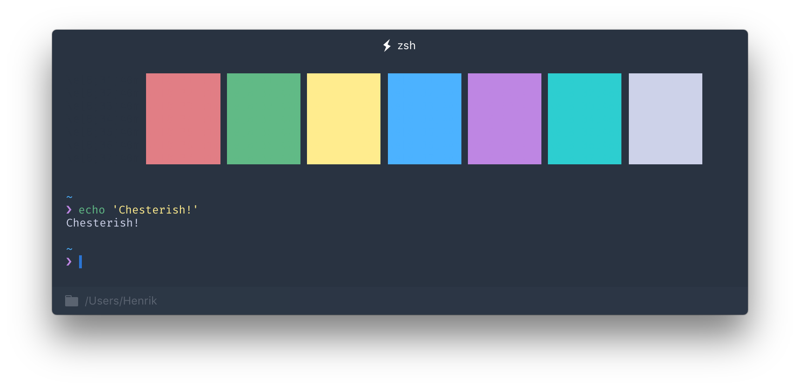
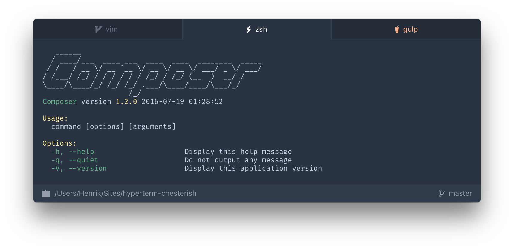

# hyperterm-chesterish   

> Chesterish Theme for [Hyper](https://hyper.is) based on [Jupyter](https://github.com/dunovank/jupyter-themes) schemes.

## Install

Add `hyperterm-chesterish` to the plugins array in your `~/.hyper.js` config file and full reload.

## Additional

To look exactly like the screens, you also need [Pure](https://github.com/sindresorhus/pure), [zsh-syntax-highlighting](https://github.com/zsh-users/zsh-syntax-highlighting), [zsh-autosuggestions](https://github.com/zsh-users/zsh-autosuggestions), [hyper-statusline](https://github.com/henrikdahl/hyper-statusline) and [Fira Code](https://github.com/tonsky/FiraCode).

## Other

* [hyperterm-base16-ocean-saturated](https://github.com/henrikdahl/hyperterm-base16-ocean-saturated)
* [hyper-statusline](https://github.com/henrikdahl/hyper-statusline)

## License

MIT © Henrik Dahlheim
