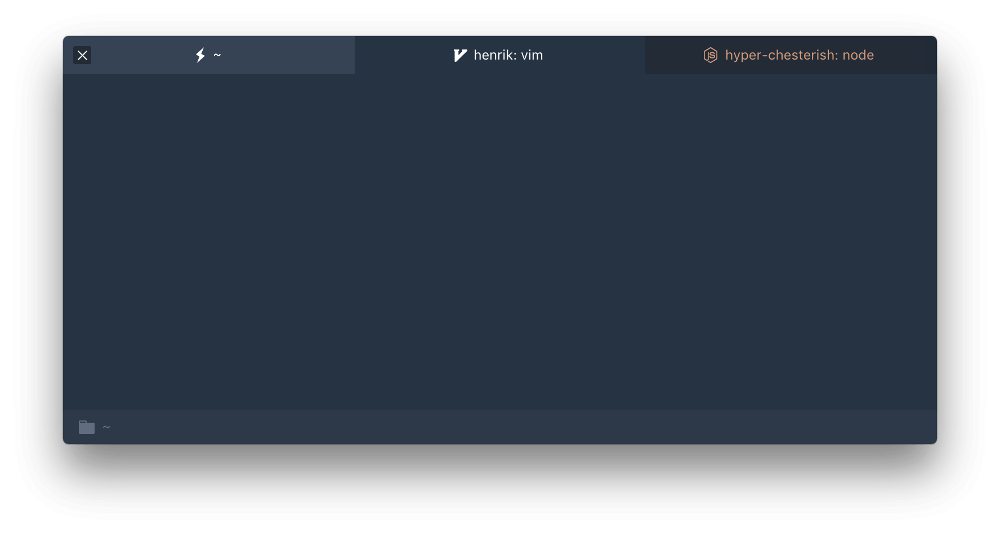

# hyper-chesterish   

> Chesterish Theme for [Hyper](https://hyper.is) based on [Jupyter](https://github.com/dunovank/jupyter-themes) schemes.

## Install

Add `hyper-chesterish` to the plugins array in your `~/.hyper.js` config.

## Plugins

* [hyper-tabs-enhanced](https://github.com/henrikdahl/hyper-tabs-enhanced)
* [hyper-statusline](https://github.com/henrikdahl/hyper-statusline)

## Other Themes

* [hyperterm-base16-ocean-saturated](https://github.com/henrikdahl/hyperterm-base16-ocean-saturated)

## License

MIT © Henrik
